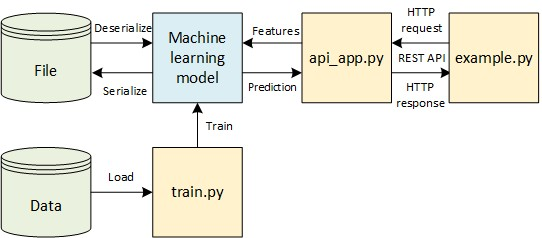

## Table of Contents
<!-- no toc -->
- [1. Introduction](#1-introduction)
- [2. Description of Python Scripts](#2-description-of-python-scripts)
- [3. Running the sample scripts](#3-running-the-sample-scripts)
- [4. Sending data via REST API](#4-sending-data-via-rest-api)

## 1. Introduction
This repositoty contains the Python scripts that train a machine learning model and deploy a machine learning system that can be accessed via REST API.

## 2. Description of Python Scripts
1. The following table lists the Python scripts in this repository and describes their roles.
   | Filename   | Description                                            |
   | :--------- | :----------------------------------------------------- |
   | train.py   | Train a kNN classifier and serialize it to a file      |
   | api_app.py | Launch an app to serve the knn classifier via REST API |
   | example.py | Example of sending data to the classifier via REST API |
2. The figure below shows the role of each Python script diagrammatically.

## 3. Running the sample scripts
1. Clone this repository or download the repository as a zip file.
2. If the repository is downloaded as a zip file, extract the zip file into its own folder.
3. Next, open a terminal in the same folder as the extracted Python scripts.
4. Enter the following command to train the model:
   - python train.py
5. Launch the API app by entering the following command in the terminal:
   - python api_app.py
6. To stop the API app, press CTRL-c in the terminal.

## 4. Sending data via REST API
1. Make sure that the API app is running
2. You can run the sample script "restapi_example.py" to send the data via http POST and GET:
   - python example.py
3. You can also send the data via a web browser by typing the following URL in the address bar:
   - http://127.0.0.1:5000/rest_api?height=160&weight=50

